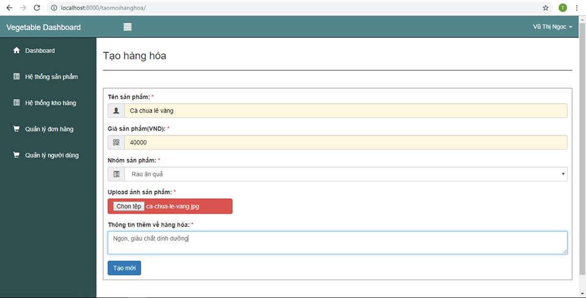

~~~~
Yêu cầu báo cáo
+ Tài liệu phân tích thiết kế (để trong docs)
-- 1. Phân tích (SRS)
-- 2. Thiết kế (SDD)
-- 3. Đặc tả kiểm thử (test case)
-- 4. Kiểm thử (kết quả test)

+ Tài liệu hướng dẫn sử dụng viết bằng markdown và cho lên Git (đặt tên README.md):
-- Mục tiêu
-- Công nghệ sử dụng
-- Hướng dẫn cài đặt (có script cài là điểm cộng)
-- Hướng dẫn sử dụng chi tiết (có hình ảnh)
-- Demo video (dung lượng lớn hơn 20MB thì để đường dẫn)
-- Hình ảnh, video, và script để trong thư mục media và link vào file markdown này, ví dụ: 

+ Comment mã nguồn (để trong src):
-- Có tài liệu cho mã nguồn là điểm cộng
-- Cho mã nguồn lên Git (lưu ý không zip toàn bộ mã nguồn)

* Lưu ý: README.md để ở thư mục root của git repo, ví dụ về cấu trúc của git repo
-- README.md
-- src
-- docs
-- media

* Project 1 nộp báo cáo tại (hạn thứ 6, 11/01/2019) 
-- https://github.com/bk-blockchain/report-submission
-- Nếu nhóm đã có github team thì nộp tại repo của nhóm 
~~~~

# Tên hệ thống

## Mục tiêu

## Công nghệ sử dụng

## Hướng dẫn cài đặt

## Hướng dẫn sử dụng

## Demo video

